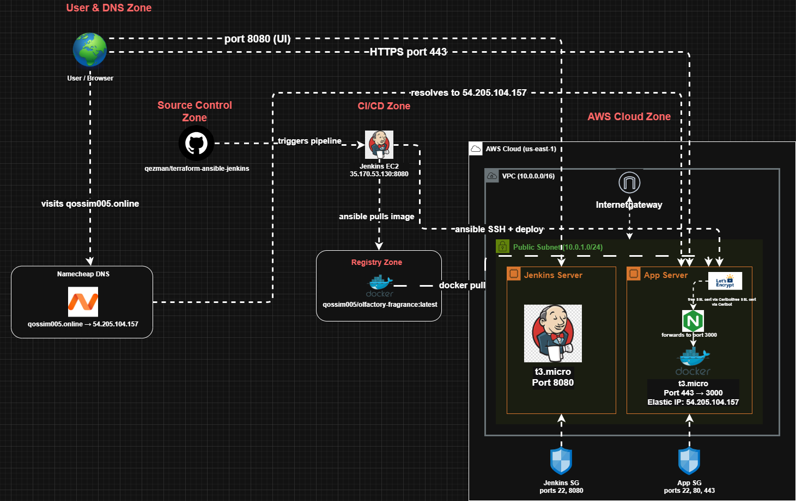

# Automated Infrastructure Provisioning

### Terraform - Ansible - Jenkins - Docker - AWS

A CI/CD pipeline that provisions cloud infrastructure, configures servers, and deploys a containerised Next.js app automatically on every code push.

---

## What it does

Push code → Jenkins runs → Ansible configures the server → Docker pulls the latest image → app is live. No manual steps.

## Stack

| Tool          | Role                                                                   |
| ------------- | ---------------------------------------------------------------------- |
| **Terraform** | Provisions VPC, EC2 instances, security groups, Elastic IP on AWS      |
| **Ansible**   | Configures servers - installs Jenkins, Docker, Nginx, obtains SSL cert |
| **Jenkins**   | Runs the CI/CD pipeline on every push                                  |
| **Docker**    | Containerises the app; image stored on Docker Hub                      |
| **Nginx**     | Reverse proxy + SSL termination via Let's Encrypt                      |
| **AWS**       | Cloud provider - EC2, VPC, Elastic IP                                  |
| **Namecheap** | Domain DNS pointing to the Elastic IP                                  |

## Architecture



## Repo Structure

```
├── terraform/        # Infrastructure as code
├── ansible/
│   ├── roles/
│   │   ├── jenkins/  # Java 21 + Jenkins install
│   │   ├── docker/   # Docker + app container deploy
│   │   └── nginx/    # Reverse proxy + SSL
│   ├── inventory.ini
│   └── site.yml
└── jenkins/
    └── Jenkinsfile   # 3-stage pipeline
```

## Pipeline

```
Checkout → Ansible Deploy → Verify
```

Ansible SSHs into the app server, pulls the latest Docker image, removes the old container, and starts the new one. Curl hits port 443 to confirm the app is live before marking the build green.

## Running it yourself

```bash
# 1. Provision infrastructure
cd terraform && terraform apply -auto-approve

# 2. Update ansible/inventory.ini with new IPs

# 3. Configure servers
cd ansible && ansible-playbook -i inventory.ini site.yml

# 4. Set up Jenkins at http://JENKINS_IP:8080
#    Create pipeline job pointing to this repo

# 5. Build Now — or push code to trigger
```

> You'll need AWS credentials, an SSH key pair, and a Docker Hub account with your image pushed.

## Teardown

```bash
cd terraform && terraform destroy -auto-approve
```

---

App: [Olfactory Fragrance](https://github.com/qezman/olfactory-fragrance) — Next.js ecommerce frontend
